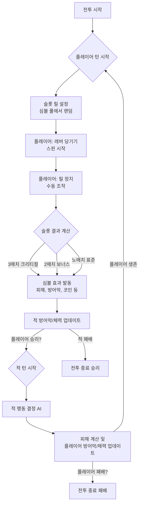

# Slots & Daggers 게임 기획서

## 목차
1. [게임 개요](#게임-개요)
2. [핵심 게임플레이](#핵심-게임플레이)
3. [전투 시스템 상세](#전투-시스템-상세)
4. [개발자 친화적 전투 시스템](#개발자-친화적-전투-시스템)
5. [슬롯머신 시스템](#슬롯머신-시스템)
6. [캐릭터 시스템](#캐릭터-시스템)
7. [무기 및 장비 시스템](#무기-및-장비-시스템)
8. [스킬 시스템](#스킬-시스템)
9. [진행 시스템](#진행-시스템)
10. [아이템 시스템](#아이템-시스템)
11. [메타 진행 시스템](#메타-진행-시스템)
12. [UI/UX 설계](#uiux-설계)
13. [기술적 구현](#기술적-구현)

---

## 게임 개요

### 게임 컨셉
**Slots & Daggers**는 슬롯머신의 확률적 요소와 RPG의 전략적 요소를 결합한 하이브리드 게임입니다. 플레이어는 슬롯머신을 통해 전투 액션을 결정하고, 캐릭터와 무기를 성장시켜 더 강력한 적들과 맞서게 됩니다.

### 핵심 특징
- **슬롯머신 기반 전투**: 전통적인 슬롯머신의 릴 스핀과 페이라인 시스템
- **RPG 성장 요소**: 캐릭터, 무기, 스킬의 레벨업과 커스터마이징
- **전략적 전투**: 슬롯 결과에 따른 전술적 판단과 리소스 관리
- **진행형 콘텐츠**: 스테이지별 난이도 증가와 새로운 콘텐츠 해금

### 타겟 플랫폼
- **PC (Windows)**: Unity 기반 데스크톱 게임
- **모바일**: 향후 확장 가능성

---

## 핵심 게임플레이

### 기본 플레이 루프
1. **챕터 시작**: 10턴으로 구성된 챕터 시작
2. **플레이어 턴**: 슬롯머신을 조작하여 공격 액션 결정
3. **공격 실행**: 슬롯 결과에 따른 공격 발동
4. **상자 획득**: 미니보스/보스 처치 시 아이템 상자 획득
5. **레벨업**: 경험치 달성 시 3개 옵션 중 선택
6. **적 턴**: 적의 공격 및 적 이동
7. **적 스폰**: 최대 적 수까지 적 스폰
8. **챕터 완료**: 보스 처치 시 챕터 클리어 및 다음 챕터 진행

### 게임 모드
- **스토리 모드**: 메인 스토리 진행 (챕터별 진행)
- **던전 모드**: 반복 플레이 가능한 던전 (향후)
- **보스 레이드**: 강력한 보스와의 전투 (향후)
- **PvP 모드**: 다른 플레이어와의 대전 (향후)

---

## 전투 시스템 상세

### 전투 필드 구조

#### 격자 시스템
- **필드 크기**: 5열 × 10명 (가로 5줄, 세로 10줄)
- **적 배치**: 각 열에 최대 10명의 적 배치 가능
- **최대 적 수**: 
  - 챕터 1: 30명
  - 챕터 진행 시: 최대 50명까지 증가
- **적 스폰**: 화면 밖에서 스폰되어 앞으로 밀려나옴

#### 공격 범위 타입
- **1열**: 첫 번째 열의 적만 공격
- **2열**: 첫 번째와 두 번째 열의 적 공격
- **전체**: 모든 열의 적 공격
- **대각선**: 대각선 방향의 적 공격
- **세로 1줄**: 세로로 한 줄 공격
- **가로 1줄**: 가로로 한 줄 공격
- **십자**: 십자 모양으로 공격
- **피격자 주변**: 피격된 적 주변 N명 추가 공격

### 전투 흐름

#### 1. 한 턴의 구성
```
플레이어 턴 → 슬롯 스핀 (공격) → 상자 획득 시 상자 오픈 → 
경험치 획득 → 레벨업 (3개 중 선택) → 적 턴 (플레이어 피격) → 적 스폰
```

#### 2. 플레이어 턴
1. **슬롯 스핀**: 슬롯머신을 조작하여 공격 액션 결정
2. **공격 실행**: 슬롯 결과에 따른 공격 발동
3. **상자 획득**: 미니보스/보스 처치 시 아이템 상자 획득 (UI에 누적)
4. **상자 오픈**: 골드를 사용하여 상자 오픈 (가격은 오픈할 때마다 증가)
5. **경험치 획득**: 적 처치 시 XP 보석이 자동으로 빨려 들어옴
6. **레벨업**: 경험치 달성 시 레벨업 (3개 옵션 중 선택)

#### 3. 적 턴
1. **적 공격**: 첫 번째 열의 적들이 플레이어를 공격
2. **보스 공격**: 보스는 위치에 관계없이 발사체로 공격
3. **적 이동**: 적들이 앞으로 이동 (필드가 비워지면 다음 열의 적이 이동)

#### 4. 적 스폰
- **스폰 타이밍**: 턴이 종료될 때마다 최대 적 수까지 스폰
- **스폰 위치**: 화면 밖에서 스폰되어 앞으로 밀려나옴
- **웨이브 증가**: 웨이브가 증가할수록 적 스탯과 스폰 수 증가
- **턴 진행**: 턴이 진행될수록 최대 몹 수 증가

### 턴제 전투 시스템
- **플레이어 턴**: 슬롯머신을 조작하여 액션 결정
- **적 턴**: AI가 자동으로 공격 실행
- **순서**: 항상 플레이어 턴 → 적 턴 순서로 진행
- **1웨이브**: 플레이어 턴 + 적 턴 = 1웨이브

### 전투 메커니즘

#### 피해 계산 시스템
```csharp
// 기본 피해 공식
BaseDamage = AttackPower * SkillMultiplier
FinalDamage = BaseDamage * CriticalMultiplier (3매치 시에만 적용)
```

#### 치명타 시스템
- **치명타 조건**: 슬롯 3개가 모두 같을 때만 발동
- **치명타 배율**: 심볼의 CritMultiplier 값 사용 (기본 2.0배)
- **치명타 시**: 추가 효과 (상태이상, 추가 피해 등)

#### 방어 시스템
- **방어막**: 일정량의 피해를 무시
- **방어막 소멸**: 턴 종료 시 일정 비율 소멸 (기본 50%)

#### 상태이상 시스템
- **출혈**: 턴마다 지속 피해
- **독**: 마법 피해로 지속 피해
- **화상**: 공격력 증가하지만 지속 피해
- **빙결**: 행동 불가, 받는 피해 증가
- **혼란**: 슬롯 결과가 랜덤하게 변경

---

## 개발자 친화적 전투 시스템

### 시스템 개요

| 항목 | 내용 |
|------|------|
| **시스템명** | Slots & Daggers Combat System |
| **핵심 목표** | 슬롯머신 기반 전투의 확률적 요소와 RPG의 전략적 요소 결합 |
| **장르/구현 범위** | 하이브리드 슬롯머신 RPG, Unity C# 기반 |

### 전투 플로우 다이어그램



### 핵심 데이터 구조

#### Symbol 구조체 (심볼 시스템의 핵심)

```csharp
[System.Serializable]
public class Symbol
{
    [Header("기본 정보")]
    public string ID;                    // 고유 식별자
    public SymbolType Type;              // 심볼 타입 (공격, 방어, 회복, 특수)
    public int BaseValue;                // 기본 효과 값
    public float CritMultiplier;         // 크리티컬 배율 (3매치 시)
    public SymbolRarity Rarity;          // 희귀도
    
    [Header("효과 설정")]
    public SymbolEffect EffectLogic;     // 효과 로직 함수
    public float Weight;                 // 가중치 (확률 계산용)
    public string Description;           // 설명 텍스트
    
    [Header("시각적 요소")]
    public Sprite Icon;                  // 아이콘
    public Color SymbolColor;            // 심볼 색상
    public ParticleSystem EffectPrefab;  // 이펙트 프리팹
}

public enum SymbolType
{
    None,
    Attack,     // 공격 심볼
    Defense,    // 방어 심볼
    Heal,       // 회복 심볼
    Special,    // 특수 심볼
    Gold,       // 골드 심볼
    Experience  // 경험치 심볼
}

public enum SymbolRarity
{
    Common,     // 일반 (흰색)
    Uncommon,   // 고급 (녹색)
    Rare,       // 희귀 (파란색)
    Epic,       // 전설 (보라색)
    Legendary   // 신화 (주황색)
}
```

#### CombatActor 구조체 (플레이어/적 공통)

```csharp
[System.Serializable]
public class CombatActor
{
    [Header("기본 스탯")]
    public int CurrentHP;                // 현재 체력
    public int MaxHP;                    // 최대 체력
    public int CurrentShield;            // 현재 방어막
    public int MaxShield;                // 최대 방어막
    public int AttackPower;              // 공격력
    
    [Header("전투 설정")]
    public List<Symbol> SymbolPool;      // 사용 가능한 심볼 풀
    public AIAttackPattern AttackPattern; // AI 공격 패턴
    public float ShieldDecayRate;        // 방어막 소멸 비율
    
    [Header("상태 효과")]
    public List<StatusEffect> ActiveEffects; // 활성 상태이상
    public bool IsStunned;               // 기절 상태
    public bool IsInvulnerable;          // 무적 상태
    
    [Header("메타 정보")]
    public string ActorName;             // 액터 이름
    public int Level;                    // 레벨
    public bool IsPlayer;                // 플레이어 여부
}

[System.Serializable]
public class StatusEffect
{
    public string EffectID;              // 효과 ID
    public float Duration;               // 지속 시간
    public int StackCount;               // 스택 수
    public float Value;                  // 효과 값
    public StatusEffectType Type;        // 효과 타입
}

public enum StatusEffectType
{
    Buff,        // 버프
    Debuff,      // 디버프
    DamageOverTime,  // 지속 피해
    HealOverTime,    // 지속 회복
    Shield,      // 방어막
    Stun,        // 기절
    Invulnerable // 무적
}
```

### 핵심 메커니즘 상세 구현

#### 4.1 슬롯 결과 계산 (F 단계)

```csharp
public class SlotResultCalculator
{
    public SlotResult CalculateResult(Symbol[] symbols)
    {
        var result = new SlotResult();
        
        // 매치 검증
        var matchType = DetermineMatchType(symbols);
        result.MatchType = matchType;
        
        // 효과 값 계산
        float finalValue = CalculateFinalValue(symbols, matchType);
        result.FinalValue = finalValue;
        
        // 효과 로직 실행
        result.Effects = ExecuteEffectLogic(symbols, finalValue);
        
        return result;
    }
    
    private MatchType DetermineMatchType(Symbol[] symbols)
    {
        // 3개 심볼이 모두 같은지 확인
        if (symbols[0].ID == symbols[1].ID && symbols[1].ID == symbols[2].ID)
            return MatchType.TripleMatch; // 3매치 (크리티컬)
        
        // 2개 심볼이 같은지 확인
        if (symbols[0].ID == symbols[1].ID || 
            symbols[1].ID == symbols[2].ID || 
            symbols[0].ID == symbols[2].ID)
            return MatchType.DoubleMatch; // 2매치 (보너스)
        
        return MatchType.NoMatch; // 노매치 (표준)
    }
    
    private float CalculateFinalValue(Symbol[] symbols, MatchType matchType)
    {
        float baseValue = symbols[0].BaseValue; // 첫 번째 심볼의 기본값 사용
        
        switch (matchType)
        {
            case MatchType.TripleMatch:
                return baseValue * symbols[0].CritMultiplier; // 3매치 시 치명타 배율 적용
            case MatchType.DoubleMatch:
                return baseValue * 1.5f; // 2매치 시 1.5배
            default:
                return baseValue; // 노매치 시 기본값
        }
    }
}

public enum MatchType
{
    NoMatch,        // 노매치
    DoubleMatch,    // 2매치
    TripleMatch     // 3매치 (크리티컬)
}
```

#### 4.2 방어막/피해 계산 (H 및 K 단계)

```csharp
public class DamageCalculator
{
    public DamageResult CalculateDamage(int incomingDamage, CombatActor target)
    {
        var result = new DamageResult();
        
        // 방어막 우선 적용
        int remainingDamage = incomingDamage - target.CurrentShield;
        target.CurrentShield = Mathf.Max(0, target.CurrentShield - incomingDamage);
        
        // 남은 피해를 체력에 적용
        int actualDamage = Mathf.Max(0, remainingDamage);
        target.CurrentHP = Mathf.Max(0, target.CurrentHP - actualDamage);
        
        result.ShieldDamage = incomingDamage - actualDamage;
        result.HPDamage = actualDamage;
        result.IsShieldBroken = target.CurrentShield == 0;
        
        return result;
    }
    
    public void ApplyShieldDecay(CombatActor actor)
    {
        // 턴 종료 시 방어막 소멸
        int decayAmount = Mathf.RoundToInt(actor.CurrentShield * actor.ShieldDecayRate);
        actor.CurrentShield = Mathf.Max(0, actor.CurrentShield - decayAmount);
    }
}

[System.Serializable]
public class DamageResult
{
    public int ShieldDamage;     // 방어막에 입은 피해
    public int HPDamage;         // 체력에 입은 피해
    public bool IsShieldBroken;  // 방어막 파괴 여부
    public bool IsCritical;      // 크리티컬 여부
}
```

#### 4.3 심볼 효과 시스템

```csharp
public class SymbolEffectSystem
{
    public List<SymbolEffect> ExecuteEffectLogic(Symbol[] symbols, float finalValue)
    {
        var effects = new List<SymbolEffect>();
        
        foreach (var symbol in symbols)
        {
            var effect = CreateEffect(symbol, finalValue);
            if (effect != null)
                effects.Add(effect);
        }
        
        return effects;
    }
    
    private SymbolEffect CreateEffect(Symbol symbol, float value)
    {
        switch (symbol.Type)
        {
            case SymbolType.Attack:
                return new AttackEffect
                {
                    Damage = Mathf.RoundToInt(value),
                    IsCritical = false // 3매치 여부는 외부에서 결정
                };
                
            case SymbolType.Defense:
                return new DefenseEffect
                {
                    ShieldAmount = Mathf.RoundToInt(value),
                    Duration = 1f
                };
                
            case SymbolType.Heal:
                return new HealEffect
                {
                    HealAmount = Mathf.RoundToInt(value),
                    IsOverTime = false
                };
                
            case SymbolType.Gold:
                return new GoldEffect
                {
                    GoldAmount = Mathf.RoundToInt(value)
                };
                
            default:
                return null;
        }
    }
}

[System.Serializable]
public abstract class SymbolEffect
{
    public string EffectID;
    public float Duration;
    public int StackCount;
}

[System.Serializable]
public class AttackEffect : SymbolEffect
{
    public int Damage;
    public bool IsCritical;
}

[System.Serializable]
public class DefenseEffect : SymbolEffect
{
    public int ShieldAmount;
}

[System.Serializable]
public class HealEffect : SymbolEffect
{
    public int HealAmount;
    public bool IsOverTime;
}

[System.Serializable]
public class GoldEffect : SymbolEffect
{
    public int GoldAmount;
}
```

---

## 슬롯머신 시스템

### 슬롯 구성
- **총 6개 슬롯**: 3x2 그리드 형태
- **슬롯 타입**: 무기, 스킬, 방어, 회복, 특수, 골드
- **가중치 시스템**: 각 심볼의 등장 확률 조절

### 슬롯 상태 관리
```csharp
public enum SlotMachineState
{
    None,           // 전투 없음
    Idle,           // 대기 상태
    Spinning,       // 슬롯이 돌아가는 중
    Stopping,       // 슬롯이 멈추는 중
    Stopped,        // 모든 슬롯이 멈춤
    Result          // 결과 표시 중
}
```

### 페이라인 시스템
- **수평 라인**: 3개 슬롯이 일렬로 연결
- **수직 라인**: 2개 슬롯이 세로로 연결
- **대각선 라인**: 대각선으로 연결된 슬롯
- **특수 라인**: L자, T자 형태의 특수 조합

### 확률 조절 시스템
- **기본 확률**: 각 심볼의 기본 등장 확률
- **가중치 조절**: 캐릭터 레벨, 무기 등급에 따른 확률 조정
- **보정 시스템**: 연속 실패 시 확률 보정

---

## 캐릭터 시스템

### 캐릭터 기본 정보
- **총 캐릭터 수**: 약 15종 (예정)
- **고유 무기**: 각 캐릭터마다 고유한 무기 1종 보유
- **고유 패시브**: 각 캐릭터마다 고유한 패시브 스킬 1종 보유
- **레벨**: 전투 중 경험치 획득으로 레벨 상승
- **경험치**: 적 처치 시 XP 보석 자동 획득

### 스탯 시스템
```csharp
public class CharacterStats
{
    public int Level;           // 레벨
    public int Experience;      // 경험치
    public int AttackPower;     // 공격력
    public int MaxHP;           // 최대 체력
    public int CurrentHP;       // 현재 체력
    public int CurrentShield;   // 현재 방어막
    public int CriticalDamage;  // 치명타 피해 배율 (3매치 시)
}
```

### 캐릭터 구성 요소
- **고유 무기**: 캐릭터마다 고유한 무기 타입 (예: 단검, 도끼, 검 등)
- **고유 패시브**: 캐릭터만의 특별한 패시브 능력
- **장비 슬롯**: 슬롯머신에 장착할 수 있는 장비들

---

## 무기 및 장비 시스템

### 장비 시스템 구조

#### 장비 슬롯
- **슬롯머신 장비**: 슬롯머신에 장착할 수 있는 장비들
- **슬롯 가득 참**: 슬롯이 모두 찬 경우 해당 장비의 업그레이드 옵션만 등장
- **장비별 옵션 테이블**: 각 장비마다 레벨업 시 등장하는 옵션 테이블이 별도로 존재

#### 장비 해금 시스템
- **기본 제공 장비**: 게임 시작 시 바로 사용 가능한 장비들
- **언락 장비**: 아웃게임에서 재화로 구매하여 해금하는 장비들
- **해금 재화**: 영구 화폐(영혼 조각, 지식의 결정 등)를 사용하여 해금

### 장비 타입 분류

#### 공격 장비
- **공격 범위**: 1열, 2열, 전체, 대각선, 세로 1줄, 가로 1줄, 십자 등
- **공격 횟수**: 한 번에 공격하는 횟수
- **공격 인원**: 한 번에 공격 가능한 적의 수
- **특수 효과**: 출혈, 감전, 처형, 흡혈, 스턴, 빙결, 넉백, 튕김 등

#### 방어/지원 장비
- **방패 계열**: 방어막 획득, 피해감소, 반사 등
- **회복 계열**: HP 회복
- **보조 계열**: 경험치 획득, 골드 획득 등

### 장비 특성

#### 공격 특성
- **공격 범위**: 적을 공격하는 범위 (1열, 2열, 전체 등)
- **공격 횟수**: 한 턴에 공격하는 횟수
- **공격 인원**: 한 번에 공격 가능한 적의 수
- **튕김 횟수**: 발사체가 튕기는 횟수
- **처형 확률**: 낮은 체력의 적을 즉시 처치하는 확률
- **치명타 확률 보정**: 공격마다 치명타 확률이 증가하는 보정

#### 특수 효과
- **출혈**: 지속 피해
- **감전**: 전기 속성 데미지 및 기절 확률
- **흡혈**: 적 처치 시 HP 회복
- **스턴**: 적을 기절시킴
- **빙결**: 적을 얼려서 행동 불가
- **넉백**: 적을 한 칸씩 밀어냄
- **전장 이탈**: 적을 필드에서 제거
- **도트**: 지속 피해 (N턴)
- **보스 우선**: 보스를 우선적으로 공격

#### 방어/지원 특성
- **방어막 획득**: 일정량의 방어막 제공
- **피해감소**: 받는 피해를 일정 비율 감소
- **피해 반사**: 감소한 피해만큼 적에게 반사
- **HP 회복**: 체력을 즉시 회복
- **경험치 획득**: 경험치 보석 획득
- **골드 획득**: 골드 획득

### 장비 레벨업 시스템
- **레벨업 조건**: 슬롯이 가득 찬 상태에서 해당 장비의 업그레이드 옵션만 등장
- **옵션 테이블**: 장비별로 고유한 레벨업 옵션 테이블 보유
- **옵션 종류**: 공격 횟수+, 튕김 횟수+, 데미지+, 치명타 확률+, 치명타 피해+, 추가 효과 확률+, 공격 인원+ 등

---

## 스킬 시스템

### 패시브 스킬 시스템

#### 고유 패시브
- **캐릭터별 고유 패시브**: 각 캐릭터마다 고유한 패시브 스킬 1종 보유
- **자동 적용**: 패시브 스킬은 전투 중 자동으로 적용됨
- **영구 효과**: 캐릭터 선택 시 항상 적용되는 효과

#### 패시브 스킬 종류
- **공격 관련**: 데미지 증가, 치명타 관련, 공격 횟수 증가 등
- **방어 관련**: 방어막 획득, 피해감소, 회피율 증가 등
- **회복 관련**: HP 회복, 회복량 증가 등
- **특수 효과**: 골드 획득, 경험치 획득, 상태이상 면역 등

### 스킬 레벨 시스템
- **고정 스킬**: 캐릭터의 고유 패시브는 레벨업하지 않음
- **아이템 효과**: 일부 아이템이 패시브 스킬과 유사한 효과 제공

---

## 진행 시스템

### 챕터 구조

#### 챕터 구성
- **챕터당 턴 수**: 10턴
- **총 턴 구조**: 플레이어 턴 + 적 턴 = 1턴
- **챕터 진행**: 챕터가 진행될수록 난이도 증가

#### 미니보스 및 보스 배치
- **3턴**: 미니보스 1마리 출현
- **5턴**: 미니보스 2마리 출현
- **8턴**: 미니보스 3마리 출현
- **10턴**: 보스 출현

#### 보상 시스템
- **미니보스 처치**: 아이템 상자 획득 (UI에 누적)
- **보스 처치**: 챕터 클리어 및 특별 보상
- **경험치**: 적 처치 시 XP 보석 자동 획득
- **골드**: 적 처치 및 상자 오픈에 사용

### 레벨업 시스템

#### 레벨업 조건
- **경험치 달성**: 적 처치 시 XP 보석 획득으로 경험치 충전
- **자동 레벨업**: 경험치가 가득 차면 자동으로 레벨업 화면 표시

#### 레벨업 선택 시스템
- **선택 옵션**: 3개의 옵션 중 1개 선택
- **옵션 분류**:
  - **장착 장비 전용 옵션**: 현재 장착 중인 장비에만 적용
  - **공용 옵션**: 캐릭터 전체에 적용

#### 장착 장비 전용 옵션
- **공격 횟수 +**: 장비의 공격 횟수 증가
- **튕김 횟수 +**: 공격이 튕기는 횟수 증가
- **데미지 +**: 장비의 기본 데미지 증가
- **치명타 확률 +**: 치명타 발생 확률 증가
- **치명타 피해 +**: 치명타 피해량 증가
- **추가 효과 확률 +**: 특수 효과(출혈, 감전 등) 발생 확률 증가
- **공격 인원 +**: 한 번에 공격 가능한 적 수 증가

#### 공용 옵션
- **최대 HP +**: 최대 체력 증가
- **데미지 ×**: 전체 데미지 배율 증가
- **즉시 HP 회복**: 현재 HP 즉시 회복
- **즉시 쉴드 획득**: 방어막 즉시 획득
- **치명타 확률 +**: 전체 치명타 확률 증가
- **치명타 피해 +**: 전체 치명타 피해 증가
- **회피율 +**: 공격 회피 확률 증가
- **피해감소 +**: 받는 피해 감소율 증가
- **랜덤 능력치 1개 얻음**: 랜덤 능력치 1개 추가 (일반 옵션보다 더 많이 얻음)
- **보스 추가 데미지 +**: 보스에게 가하는 추가 데미지 증가

### 아이템 상자 시스템

#### 상자 획득
- **획득 조건**: 미니보스 또는 보스 처치 성공 시
- **UI 표시**: 상자가 획득되면 UI에 누적 표시
- **누적 저장**: 여러 개의 상자가 누적되어 저장됨

#### 상자 오픈 시스템
- **오픈 방법**: 골드를 사용하여 상자 오픈
- **가격 증가**: 상자를 열 때마다 오픈 가격이 증가
- **오픈 타이밍**: 플레이어 턴 중 언제든지 오픈 가능

#### 상자 내용물
- **아이템**: Common, Uncommon, Rare, Epic, Legendary 등급 아이템
- **확률**: 등급별 드롭 확률이 다름
- **보상**: 랜덤으로 아이템 획득

---

## 아이템 시스템

### 아이템 등급 시스템

#### Common (일반)
- **최대 HP +**: 최대 체력 증가
- **데미지 ×**: 전체 데미지 배율 증가
- **즉시 HP 회복**: 현재 HP 즉시 회복
- **즉시 쉴드 획득**: 방어막 즉시 획득
- **치명타 확률 +**: 전체 치명타 확률 증가
- **치명타 피해 +**: 전체 치명타 피해 증가
- **회피율 +**: 공격 회피 확률 증가
- **피해감소 +**: 받는 피해 감소율 증가

#### Uncommon (고급)
- **턴 종료 시 보유한 골드의 10% 획득**: 턴 종료 시 골드 일부 획득
- **슬롯이 멈출 때, 30% 확률로 골드 5**: 슬롯 멈출 때 골드 획득
- **상점 할인율 10%**: 상점 아이템 가격 할인
- **상자 할인율 15%**: 상자 오픈 가격 할인
- **회피 시 HP 회복**: 회피 성공 시 HP 회복
- **발사체 튕길 때마다 데미지 10% 증가**: 튕김마다 데미지 증가 (매번 리셋)
- **잃은 HP % 만큼 데미지 % 증가**: 체력 비율에 따른 데미지 증가
- **골드 획득량 증가**: 골드 획득량 증가
- **턴이 종료 시, 데미지 % 증가**: 턴 종료 시 데미지 증가 (챕터 이동 시 리셋)
- **상점 첫 구매 70% 할인**: 상점 첫 구매 시 대폭 할인
- **회피 할 때마다 다음턴 데미지 15% 증가**: 회피 시 다음 턴 데미지 증가 (다음턴 종료 시 리셋)

#### Rare (희귀)
- **턴 종료시 HP 30 회복**: 턴 종료 시 자동 회복
- **현재 보유한 골드 1% 추가 데미지**: 골드에 비례한 데미지 증가
- **보스 소환 +1**: 보스 처치 시 추가 보스 소환
- **처치 시 회복 아이템을 드랍할 확률 2% 증가**: 적 처치 시 회복 아이템 드롭 확률 증가
- **회복 할 때마다 데미지 15% 증가**: 회복 시 데미지 증가 (턴 종료 시 리셋)
- **슬롯을 굴릴 때 30% 확률로 한번 또 굴림**: 슬롯 추가 굴림 기회
- **적이 상자를 드롭할 확률 증가**: 적 처치 시 상자 드롭 확률 증가
- **상자가 드롭 될 때 2개 드롭될 확률 증가**: 상자 드롭 시 2개 드롭 확률 증가
- **보스 처치 시 HP 100 회복**: 보스 처치 시 대량 회복
- **보스 처치 시 데미지 10% 증가**: 보스 처치 시 데미지 영구 증가
- **가시 +**: 적 공격 시 반사 데미지

#### Epic (전설)
- **현재 적수의 비례해서 데미지 % 증가**: 적 수에 비례한 데미지 증가
- **공격 시 쉴드량의 50% 만큼 추가 피해**: 방어막에 비례한 추가 데미지
- **아이템 상자를 획득 할 때마다 데미지 2% 증가**: 상자 획득 시 데미지 영구 증가
- **치명타가 30% 확률로 데미지 x4**: 치명타 시 추가 데미지 배율
- **공격 시 뒷줄의 적 같이 공격**: 뒷줄 적 추가 공격
- **적이 도트 피해 입을 때 양 옆의 적도 적용**: 도트 피해 전파
- **모든 회복 x1.5**: 회복량 1.5배 증가
- **흡혈 할 때마다 쉴드 1 얻음**: 흡혈 시 방어막 추가 획득
- **한턴에서 굴린 슬롯 수만큼 HP 회복**: 슬롯 수만큼 회복
- **같은 슬롯 갯수 1개당 데미지 15% 증가**: 동일 슬롯 수에 비례한 데미지 증가

#### Legendary (신화)
- **모든 무기 공격 횟수 +**: 모든 장비의 공격 횟수 증가
- **체력을 회복할 때마다 데미지 1% 증가**: 회복 시 데미지 영구 증가
- **공격이 아닌 슬롯일 때, 임의 적 한명 공격**: 비공격 슬롯도 공격 효과
- **쉴드를 얻을 때마다 임의 적 한명 공격**: 방어막 획득 시 공격 효과
- **적을 처치할 때마다 HP 5 회복**: 적 처치 시 소량 회복
- **30% 확률로 슬롯을 한번 더 돌림**: 슬롯 추가 굴림 확률
- **슬롯을 돌릴 때 30% 확률로 양옆 슬롯을 한번 더 발동**: 양옆 슬롯 추가 발동
- **모든 공격에 흡혈 2**: 모든 공격에 흡혈 효과
- **공격 시 양 옆의 적 같이 공격**: 양옆 적 추가 공격
- **마지막 슬롯을 종료 후 모든 슬롯을 한번 다시 굴림**: 마지막 슬롯 후 전체 재굴림

### 아이템 획득 방법
- **상자 오픈**: 골드를 사용하여 아이템 상자 오픈
- **드롭 확률**: 등급별로 다른 드롭 확률
- **아이템 효과**: 획득 즉시 자동 적용

---

## 메타 진행 시스템

### 영구 화폐 시스템 (Permanent Currency)

플레이어가 전투에서 패배해도 다음 런에 영향을 줄 수 있는 영구적인 성장 요소를 제공합니다.

#### 영구 화폐 종류

| 화폐명 | 획득 방법 | 사용 용도 | 설명 |
|--------|-----------|-----------|------|
| **영혼 조각 (Soul Fragments)** | 전투 승리, 보스 처치 | 기본 스탯 영구 증가 | HP, 공격력 등 기본 스탯 향상 |
| **지식의 결정 (Knowledge Crystals)** | 챕터 클리어, 던전 완료 | 장비 해금 | 새로운 장비 해금 |
| **마법의 에센스 (Magic Essence)** | 특수 이벤트, 보스 레이드 | 특수 능력 해금 | 패시브 스킬, 특수 효과 해금 |
| **전설의 파편 (Legendary Shards)** | 월드 보스, 특수 던전 | 전설 장비 제작 | 최고 등급 장비 제작 재료 |

#### 장비 해금 시스템
- **아웃게임 구매**: 아웃게임에서 영구 화폐로 장비 해금
- **해금 재화**: 지식의 결정 또는 다른 영구 화폐 사용
- **기본 제공 장비**: 게임 시작 시 제공되는 기본 장비들
- **언락 장비**: 아웃게임에서 구매하여 해금하는 장비들

#### 영구 업그레이드 시스템

```csharp
[System.Serializable]
public class MetaProgressionData
{
    [Header("영구 화폐")]
    public int SoulFragments;           // 영혼 조각
    public int KnowledgeCrystals;       // 지식의 결정
    public int MagicEssence;            // 마법의 에센스
    public int LegendaryShards;         // 전설의 파편
    
    [Header("영구 업그레이드")]
    public int BaseHPUpgrade;           // 기본 HP 증가
    public int BaseAttackUpgrade;       // 기본 공격력 증가
    public int BaseDefenseUpgrade;      // 기본 방어력 증가
    public int SymbolPoolSize;          // 심볼 풀 크기
    public int UnlockedSymbols;         // 해금된 심볼 수
    public int PassiveSkillPoints;      // 패시브 스킬 포인트
    
    [Header("진행도")]
    public int MaxStageReached;         // 도달한 최고 스테이지
    public int TotalBossesDefeated;     // 처치한 보스 수
    public int TotalRunsCompleted;      // 완료한 런 수
    public float TotalPlayTime;         // 총 플레이 시간
}

[System.Serializable]
public class PermanentUpgrade
{
    public string UpgradeID;            // 업그레이드 ID
    public string Name;                 // 업그레이드 이름
    public string Description;          // 설명
    public CurrencyType RequiredCurrency; // 필요 화폐 타입
    public int RequiredAmount;          // 필요 수량
    public int CurrentLevel;            // 현재 레벨
    public int MaxLevel;                // 최대 레벨
    public float[] LevelValues;         // 레벨별 효과 값
    public bool IsUnlocked;             // 해금 여부
}

public enum CurrencyType
{
    SoulFragments,      // 영혼 조각
    KnowledgeCrystals,  // 지식의 결정
    MagicEssence,       // 마법의 에센스
    LegendaryShards     // 전설의 파편
}
```

### 메타 진행 매니저

```csharp
public class MetaProgressionManager : MonoBehaviour
{
    [SerializeField] private MetaProgressionData _metaData;
    [SerializeField] private List<PermanentUpgrade> _availableUpgrades;
    
    public static MetaProgressionManager Instance { get; private set; }
    
    private void Awake()
    {
        if (Instance == null)
        {
            Instance = this;
            DontDestroyOnLoad(gameObject);
            LoadMetaData();
        }
        else
        {
            Destroy(gameObject);
        }
    }
    
    public bool CanAffordUpgrade(PermanentUpgrade upgrade)
    {
        return GetCurrencyAmount(upgrade.RequiredCurrency) >= upgrade.RequiredAmount;
    }
    
    public bool PurchaseUpgrade(PermanentUpgrade upgrade)
    {
        if (!CanAffordUpgrade(upgrade) || upgrade.CurrentLevel >= upgrade.MaxLevel)
            return false;
        
        // 화폐 차감
        SpendCurrency(upgrade.RequiredCurrency, upgrade.RequiredAmount);
        
        // 업그레이드 적용
        upgrade.CurrentLevel++;
        ApplyUpgradeEffect(upgrade);
        
        // 저장
        SaveMetaData();
        
        return true;
    }
    
    private void ApplyUpgradeEffect(PermanentUpgrade upgrade)
    {
        switch (upgrade.UpgradeID)
        {
            case "base_hp":
                _metaData.BaseHPUpgrade = (int)upgrade.LevelValues[upgrade.CurrentLevel - 1];
                break;
            case "base_attack":
                _metaData.BaseAttackUpgrade = (int)upgrade.LevelValues[upgrade.CurrentLevel - 1];
                break;
            case "symbol_pool_size":
                _metaData.SymbolPoolSize = (int)upgrade.LevelValues[upgrade.CurrentLevel - 1];
                break;
            // 추가 업그레이드 효과들...
        }
    }
    
    public void AddCurrency(CurrencyType type, int amount)
    {
        switch (type)
        {
            case CurrencyType.SoulFragments:
                _metaData.SoulFragments += amount;
                break;
            case CurrencyType.KnowledgeCrystals:
                _metaData.KnowledgeCrystals += amount;
                break;
            case CurrencyType.MagicEssence:
                _metaData.MagicEssence += amount;
                break;
            case CurrencyType.LegendaryShards:
                _metaData.LegendaryShards += amount;
                break;
        }
        
        SaveMetaData();
    }
    
    private int GetCurrencyAmount(CurrencyType type)
    {
        switch (type)
        {
            case CurrencyType.SoulFragments: return _metaData.SoulFragments;
            case CurrencyType.KnowledgeCrystals: return _metaData.KnowledgeCrystals;
            case CurrencyType.MagicEssence: return _metaData.MagicEssence;
            case CurrencyType.LegendaryShards: return _metaData.LegendaryShards;
            default: return 0;
        }
    }
    
    private void SpendCurrency(CurrencyType type, int amount)
    {
        switch (type)
        {
            case CurrencyType.SoulFragments:
                _metaData.SoulFragments -= amount;
                break;
            case CurrencyType.KnowledgeCrystals:
                _metaData.KnowledgeCrystals -= amount;
                break;
            case CurrencyType.MagicEssence:
                _metaData.MagicEssence -= amount;
                break;
            case CurrencyType.LegendaryShards:
                _metaData.LegendaryShards -= amount;
                break;
        }
    }
    
    private void LoadMetaData()
    {
        // JSON 파일에서 메타 데이터 로드
        string json = PlayerPrefs.GetString("MetaProgressionData", "");
        if (!string.IsNullOrEmpty(json))
        {
            _metaData = JsonUtility.FromJson<MetaProgressionData>(json);
        }
    }
    
    private void SaveMetaData()
    {
        // JSON 파일로 메타 데이터 저장
        string json = JsonUtility.ToJson(_metaData, true);
        PlayerPrefs.SetString("MetaProgressionData", json);
    }
}
```

### 심볼 풀 확장 시스템

```csharp
[System.Serializable]
public class SymbolPoolManager
{
    [Header("기본 심볼 풀")]
    public List<Symbol> BaseSymbolPool;     // 기본 심볼들
    
    [Header("해금된 심볼")]
    public List<Symbol> UnlockedSymbols;   // 해금된 심볼들
    
    [Header("현재 런 심볼 풀")]
    public List<Symbol> CurrentRunPool;    // 현재 런에서 사용할 심볼들
    
    public void InitializeRunPool()
    {
        CurrentRunPool.Clear();
        
        // 기본 심볼 풀에서 선택
        var availableSymbols = new List<Symbol>();
        availableSymbols.AddRange(BaseSymbolPool);
        availableSymbols.AddRange(UnlockedSymbols);
        
        // 메타 진행에 따른 풀 크기 적용
        int poolSize = MetaProgressionManager.Instance.GetSymbolPoolSize();
        
        for (int i = 0; i < poolSize; i++)
        {
            var randomSymbol = GetWeightedRandomSymbol(availableSymbols);
            CurrentRunPool.Add(randomSymbol);
        }
    }
    
    private Symbol GetWeightedRandomSymbol(List<Symbol> symbols)
    {
        float totalWeight = 0f;
        foreach (var symbol in symbols)
        {
            totalWeight += symbol.Weight;
        }
        
        float randomValue = Random.Range(0f, totalWeight);
        float currentWeight = 0f;
        
        foreach (var symbol in symbols)
        {
            currentWeight += symbol.Weight;
            if (randomValue <= currentWeight)
            {
                return symbol;
            }
        }
        
        return symbols[0]; // 기본값
    }
    
    public Symbol[] GetRandomSymbols(int count)
    {
        var result = new Symbol[count];
        
        for (int i = 0; i < count; i++)
        {
            result[i] = CurrentRunPool[Random.Range(0, CurrentRunPool.Count)];
        }
        
        return result;
    }
}
```

### 패시브 스킬 시스템

```csharp
[System.Serializable]
public class PassiveSkill
{
    public string SkillID;              // 스킬 ID
    public string Name;                 // 스킬 이름
    public string Description;          // 설명
    public int RequiredLevel;           // 필요 레벨
    public int CurrentLevel;            // 현재 레벨
    public int MaxLevel;                // 최대 레벨
    public CurrencyType RequiredCurrency; // 필요 화폐
    public int RequiredAmount;          // 필요 수량
    public bool IsUnlocked;             // 해금 여부
    public PassiveSkillEffect Effect;   // 효과 타입
    
    public void ApplyEffect(CombatActor actor)
    {
        switch (Effect)
        {
            case PassiveSkillEffect.IncreasedAttackPower:
                actor.AttackPower += CurrentLevel * 5; // 레벨당 5 증가
                break;
            case PassiveSkillEffect.IncreasedShieldDuration:
                actor.ShieldDecayRate -= CurrentLevel * 0.1f; // 레벨당 10% 감소
                break;
            case PassiveSkillEffect.BonusGold:
                // 골드 획득 시 추가 보너스
                break;
            // 추가 패시브 효과들...
        }
    }
}

public enum PassiveSkillEffect
{
    IncreasedAttackPower,       // 공격력 증가
    IncreasedShieldDuration,    // 방어막 지속 시간 증가
    BonusGold,                  // 골드 획득량 증가
    IncreasedSymbolWeight,      // 특정 심볼 가중치 증가
    ExtraTurnChance,            // 추가 턴 확률
    DamageReflection,           // 피해 반사
    LifeSteal,                  // 생명력 흡수
    IncreasedMaxHP              // 최대 체력 증가
}
```

### 진행도 추적 시스템

```csharp
public class ProgressTracker : MonoBehaviour
{
    [SerializeField] private MetaProgressionData _metaData;
    
    public void OnStageCompleted(int stageNumber, bool isBossStage)
    {
        // 최고 스테이지 업데이트
        if (stageNumber > _metaData.MaxStageReached)
        {
            _metaData.MaxStageReached = stageNumber;
        }
        
        // 보스 처치 시 추가 보상
        if (isBossStage)
        {
            _metaData.TotalBossesDefeated++;
            MetaProgressionManager.Instance.AddCurrency(CurrencyType.SoulFragments, 10);
            MetaProgressionManager.Instance.AddCurrency(CurrencyType.KnowledgeCrystals, 5);
        }
        
        // 스테이지 클리어 보상
        MetaProgressionManager.Instance.AddCurrency(CurrencyType.SoulFragments, 5);
    }
    
    public void OnRunCompleted(bool isVictory)
    {
        _metaData.TotalRunsCompleted++;
        
        if (isVictory)
        {
            // 승리 시 추가 보상
            MetaProgressionManager.Instance.AddCurrency(CurrencyType.SoulFragments, 20);
        }
        else
        {
            // 패배 시에도 기본 보상
            MetaProgressionManager.Instance.AddCurrency(CurrencyType.SoulFragments, 5);
        }
    }
    
    public void OnPlayTimeUpdate(float deltaTime)
    {
        _metaData.TotalPlayTime += deltaTime;
    }
}
```

### 메타 진행 UI

```csharp
public class MetaProgressionUI : MonoBehaviour
{
    [Header("UI 컴포넌트")]
    [SerializeField] private TextMeshProUGUI _soulFragmentsText;
    [SerializeField] private TextMeshProUGUI _knowledgeCrystalsText;
    [SerializeField] private TextMeshProUGUI _magicEssenceText;
    [SerializeField] private TextMeshProUGUI _legendaryShardsText;
    
    [SerializeField] private Transform _upgradeContainer;
    [SerializeField] private GameObject _upgradePrefab;
    
    private List<UpgradeUI> _upgradeUIs = new List<UpgradeUI>();
    
    private void Start()
    {
        UpdateCurrencyDisplay();
        CreateUpgradeUI();
    }
    
    private void UpdateCurrencyDisplay()
    {
        var metaData = MetaProgressionManager.Instance.GetMetaData();
        
        _soulFragmentsText.text = metaData.SoulFragments.ToString();
        _knowledgeCrystalsText.text = metaData.KnowledgeCrystals.ToString();
        _magicEssenceText.text = metaData.MagicEssence.ToString();
        _legendaryShardsText.text = metaData.LegendaryShards.ToString();
    }
    
    private void CreateUpgradeUI()
    {
        var upgrades = MetaProgressionManager.Instance.GetAvailableUpgrades();
        
        foreach (var upgrade in upgrades)
        {
            var upgradeUI = Instantiate(_upgradePrefab, _upgradeContainer);
            var upgradeComponent = upgradeUI.GetComponent<UpgradeUI>();
            upgradeComponent.Setup(upgrade, OnUpgradePurchased);
            _upgradeUIs.Add(upgradeComponent);
        }
    }
    
    private void OnUpgradePurchased(PermanentUpgrade upgrade)
    {
        if (MetaProgressionManager.Instance.PurchaseUpgrade(upgrade))
        {
            UpdateCurrencyDisplay();
            // 업그레이드 UI 업데이트
        }
    }
}
```

### 메타 진행의 핵심 원칙

1. **패배해도 성장**: 전투에서 패배해도 영구 화폐를 획득하여 다음 런에 도움이 됩니다.

2. **의미 있는 선택**: 여러 업그레이드 옵션 중에서 플레이어가 전략적으로 선택할 수 있습니다.

3. **점진적 해금**: 게임을 진행하면서 새로운 심볼, 스킬, 업그레이드가 해금됩니다.

4. **장기적 목표**: 최고 등급 장비나 특수 능력 해금 등 장기적인 목표를 제공합니다.

5. **재플레이 가치**: 메타 진행을 통해 매번 다른 경험을 할 수 있습니다.

---

## UI/UX 설계

### 메인 화면
- **캐릭터 정보**: 레벨, 경험치, 스탯 표시
- **장비 슬롯**: 착용 중인 장비 표시
- **스킬 트리**: 보유 중인 스킬과 포인트 표시
- **인벤토리**: 보유 중인 아이템 관리

### 전투 화면
- **슬롯머신**: 중앙에 위치한 6개 슬롯
- **캐릭터 정보**: HP, MP, 버프/디버프 상태
- **적 정보**: 적의 HP, 상태이상 표시
- **액션 버튼**: 스핀, 스톱, 스킬 사용

### 인벤토리 화면
- **장비 탭**: 무기, 방어구, 액세서리
- **소모품 탭**: 포션, 스크롤, 재료
- **스킬 탭**: 보유 스킬과 스킬 포인트
- **설정 탭**: 게임 옵션과 설정

### 상점 화면
- **장비 상점**: 무기, 방어구 구매
- **소모품 상점**: 포션, 스크롤 구매
- **강화 상점**: 강화 재료 구매
- **특별 상점**: 희귀 아이템 구매

---

## 기술적 구현

### 아키텍처 설계
- **MVC 패턴**: Model-View-Controller 구조
- **컴포넌트 시스템**: Unity의 컴포넌트 기반 설계
- **이벤트 시스템**: 느슨한 결합을 위한 이벤트 기반 통신

### 핵심 클래스 구조
```csharp
// 전투 관리
public class BattleManager
{
    public enum BattleState { None, Preparing, InProgress, Paused, Ended }
    public void StartBattle();
    public void EndBattle();
    public void PauseBattle();
}

// 슬롯머신 관리
public class HUDSlotMachine
{
    public SlotMachineState CurrentState;
    public void StartSpin();
    public void StopNextSlot();
    public void OnSlotMachineCompleted();
}

// 피해 계산
public class DamageCalculator
{
    public void Execute();
    public void SetAttacker(Character attacker);
    public void SetTargetVital(Vital targetVital);
}
```

### 데이터 관리
- **ScriptableObject**: 게임 데이터 저장
- **JSON**: 설정 파일과 저장 데이터
- **Addressable**: 리소스 관리

### 성능 최적화
- **LOD 시스템**: 거리에 따른 디테일 레벨 조절
- **배치 처리**: 유사한 연산의 배치 처리

### 확장성 고려
- **모듈화**: 각 시스템의 독립적 개발 가능
- **데이터 기반**: 코드 수정 없이 데이터로 밸런스 조절
- **플러그인 시스템**: 새로운 콘텐츠 추가 용이

---

## 밸런싱 가이드

### 난이도 곡선
- **초기 구간 (1-20레벨)**: 쉬운 난이도로 게임 이해
- **중기 구간 (21-60레벨)**: 점진적 난이도 증가
- **후기 구간 (61-100레벨)**: 고난이도 콘텐츠

### 경제 시스템
- **골드 획득량**: 스테이지별 적절한 골드 보상
- **아이템 가격**: 강화 비용과 획득량의 균형
- **경험치**: 레벨업에 필요한 적절한 시간

### 전투 밸런스
- **공격력**: 적의 체력에 비례한 적절한 공격력
- **방어력**: 받는 피해의 적절한 감소율
- **치명타**: 전략적 요소가 되는 적절한 확률

---

## 시스템 구현 우선순위

빌드 기반 테스트를 고려한 시스템 구현 순서를 정의합니다.

### Build 1: 게임 진입 및 플레이어 캐릭터 공격

**목표**: 캐릭터 1종을 선택하여 들어와 슬롯머신을 통해 적 공격 → 적 사망

#### 1.1 캐릭터 선택 및 데이터 시스템
- **구현 내용**:
  - 세이브 데이터에 기본 캐릭터 1종 추가
  - 캐릭터 데이터 구조 (최대 체력 / 최대 쉴드 / 기본 심볼)
  - 타이틀 화면 캐릭터 선택 팝업
  - 캐릭터 선택 후 게임 메인씬 이동
- **테스트 목표**: 캐릭터를 선택하고 게임에 진입할 수 있는가?

#### 1.2 슬롯머신 기본 시스템
- **구현 내용**:
  - 개발용 기본 몬스터 생성
  - 플레이어 캐릭터 체력/보호막 설정
  - 슬롯머신 슬롯 구성 (슬롯 후보 설정, 슬롯 잠금 갱신)
  - SPIN/STOP 버튼 기능
  - 슬롯 실행 시스템 (공격 / 보호막 / 재화 획득)
- **테스트 목표**: 슬롯머신을 조작하여 적을 공격할 수 있는가?

---

### Build 2: 스테이지 선택 및 적 AI

**목표**: 스테이지 선택 및 몬스터 생성 / 이동 시스템

#### 2.1 스테이지 및 몬스터 데이터 시스템
- **구현 내용**:
  - 스테이지 데이터 구조 (등장 몬스터 이름/레벨, 몬스터 생성 위치)
  - 몬스터 데이터 구조 (체력/쉴드/공격방식/피해량/보상목록)
  - 몬스터 공격 패턴 및 이동 방식
  - 몬스터 차지 영역 및 공격 범위 설정
- **테스트 목표**: 스테이지와 몬스터 데이터가 올바르게 로드되는가?

#### 2.2 스테이지 선택 및 몬스터 생성 시스템
- **구현 내용**:
  - 타이틀 씬에서 스테이지 선택 팝업
  - 세이브 데이터에 선택한 스테이지 저장
  - 메인 씬에서 선택한 스테이지에 맞는 몬스터 생성
  - 몬스터 이동 AI 적용
  - 플레이어 캐릭터 적 목표 설정
- **테스트 목표**: 스테이지를 선택하고 몬스터가 올바르게 생성되는가?

---

### Build 3: 핵심 게임 플레이

**목표**: 핵심 게임플레이인 공격 / 보상 / 레벨 업

#### 3.1 전투 시스템 완성
- **구현 내용**:
  - 몬스터 공격 AI 적용
  - 심볼별 공격 범위 시스템 (1열, 2열, 전체)
  - 심볼 매칭 시스템 (3매치 치명타)
  - 플레이어 피격 및 사망 처리
- **테스트 목표**: 완전한 전투 루프가 작동하는가?

#### 3.2 전투 밸런싱
- **구현 내용**:
  - 공격 범위별 데미지 계산
  - 치명타 시스템 정교화
  - 사망 조건 및 게임 종료 처리
  - 전투 UI 피드백 시스템
- **테스트 목표**: 전투가 균형잡히고 재미있는가?

---

### Build 4: 보상 및 진행 시스템 (Progression)

**목표**: 게임 진행을 위한 보상 시스템

#### 4.1 보상 시스템
- **구현 내용**:
  - 경험치 드랍 시스템
  - 골드 드랍 시스템
  - 보상 상자 드랍 시스템
  - 상자 구매 UI 및 심볼 획득
- **테스트 목표**: 적 처치 시 보상을 올바르게 획득하는가?

#### 4.2 레벨업 및 챕터 진행 시스템
- **구현 내용**:
  - 레벨업 UI 및 능력치 강화 시스템
  - 10턴 챕터 진행 구조
  - 미니보스 및 보스 등장 시스템
  - 챕터 클리어 조건 및 다음 챕터 진행
- **테스트 목표**: 레벨업과 챕터 진행이 정상 작동하는가?

---

### Build 5: 장비 확장 (Content)

**목표**: 다양한 장비와 전략성 추가

#### 5.1 장비 시스템 확장
- **구현 내용**:
  - 추가 장비 10-15종
  - 특수 효과 시스템 (출혈, 감전, 스턴 등)
  - 장비별 레벨업 옵션 테이블
- **테스트 목표**: 다양한 장비로 다른 전략을 구사할 수 있는가?

#### 5.2 아이템 시스템
- **구현 내용**:
  - Common/Uncommon 아이템 구현
  - 아이템 효과 시스템
  - 등급별 드롭 확률
- **테스트 목표**: 아이템을 통한 캐릭터 강화가 가능한가?

---

### Build 6: 캐릭터 시스템 (Variety)

**목표**: 다양한 캐릭터와 재플레이성

#### 6.1 멀티 캐릭터 시스템
- **구현 내용**:
  - 3-5종 캐릭터 구현
  - 고유 무기 시스템
  - 고유 패시브 스킬
  - 캐릭터별 다른 플레이 경험
- **테스트 목표**: 캐릭터별로 다른 플레이 경험을 제공하는가?

#### 6.2 고급 아이템
- **구현 내용**:
  - Rare/Epic/Legendary 아이템
  - 복잡한 아이템 효과
  - 아이템 조합 시스템
- **테스트 목표**: 고급 아이템의 강력한 효과를 확인할 수 있는가?

---

### Build 7: 메타 진행 (Retention)

**목표**: 장기적 재플레이성

#### 7.1 메타 진행 시스템
- **구현 내용**:
  - 영구 화폐 시스템
  - 장비 해금 시스템
  - 아웃게임 UI
  - 진행도 추적
- **테스트 목표**: 메타 진행을 통한 장기적 성장이 가능한가?

#### 7.2 밸런싱 및 최적화
- **구현 내용**:
  - 난이도 곡선 조정
  - 아이템 드롭률 조정
  - 성능 최적화
  - 버그 수정
- **테스트 목표**: 게임이 안정적이고 균형잡혀 있는가?

---

### 빌드별 구현 일정 (예상)

| Build | 기간 | 주요 마일스톤 | 핵심 기능 |
|-------|------|---------------|-----------|
| Build 1 | 1-2주 | 기본 전투 루프 | 캐릭터 선택 → 슬롯머신 → 적 공격 |
| Build 2 | 1-2주 | 스테이지 시스템 | 스테이지 선택 → 몬스터 생성/이동 |
| Build 3 | 2-3주 | 완전한 전투 | 공격 범위 → 매칭 시스템 → 사망 처리 |
| Build 4 | 2-3주 | 보상 시스템 | 경험치 → 레벨업 → 상자 → 챕터 진행 |
| Build 5 | 3-4주 | 장비 확장 | 다양한 장비와 특수 효과 |
| Build 6 | 2-3주 | 멀티 캐릭터 | 캐릭터별 다른 경험 |
| Build 7 | 2-3주 | 메타 진행 | 완성도 높은 빌드 |

### 각 빌드별 핵심 테스트 포인트

#### Build 1 테스트
- [ ] 캐릭터를 선택하고 게임에 진입할 수 있는가?
- [ ] 슬롯머신을 조작하여 적을 공격할 수 있는가?
- [ ] 적이 사망하는가?

#### Build 2 테스트
- [ ] 스테이지를 선택하고 게임에 진입할 수 있는가?
- [ ] 몬스터가 올바르게 생성되고 배치되는가?
- [ ] 몬스터 이동 AI가 정상 작동하는가?

#### Build 3 테스트
- [ ] 심볼별 공격 범위가 올바르게 작동하는가?
- [ ] 3매치 치명타 시스템이 정상 작동하는가?
- [ ] 플레이어/적 사망 처리가 올바른가?

#### Build 4 테스트
- [ ] 적 처치 시 경험치와 골드를 획득하는가?
- [ ] 레벨업 UI가 정상 작동하는가?
- [ ] 10턴 챕터가 정상 진행되는가?

#### Build 5 테스트
- [ ] 다양한 장비로 다른 전략을 구사할 수 있는가?
- [ ] 아이템을 통한 캐릭터 강화가 가능한가?

#### Build 6 테스트
- [ ] 캐릭터별로 다른 플레이 경험을 제공하는가?

#### Build 7 테스트
- [ ] 메타 진행을 통한 장기적 성장이 가능한가?
- [ ] 게임이 안정적이고 균형잡혀 있는가?

---

## 향후 개발 계획

### 단계별 개발
1. **1단계**: 기본 전투 시스템과 슬롯머신 구현
2. **2단계**: 캐릭터 성장과 장비 시스템 추가
3. **3단계**: 스킬 시스템과 던전 콘텐츠 추가
4. **4단계**: PvP와 소셜 기능 추가

### 콘텐츠 확장
- **새로운 캐릭터 클래스**: 추가 직업과 특성
- **새로운 무기 타입**: 다양한 무기와 장비
- **새로운 스킬**: 더 많은 스킬과 조합
- **새로운 던전**: 계속 추가되는 콘텐츠

### 기술적 개선
- **모바일 최적화**: 터치 인터페이스와 성능 최적화
- **멀티플레이어**: 실시간 대전과 협력 플레이
- **크로스 플랫폼**: 다양한 플랫폼 간 연동

---
